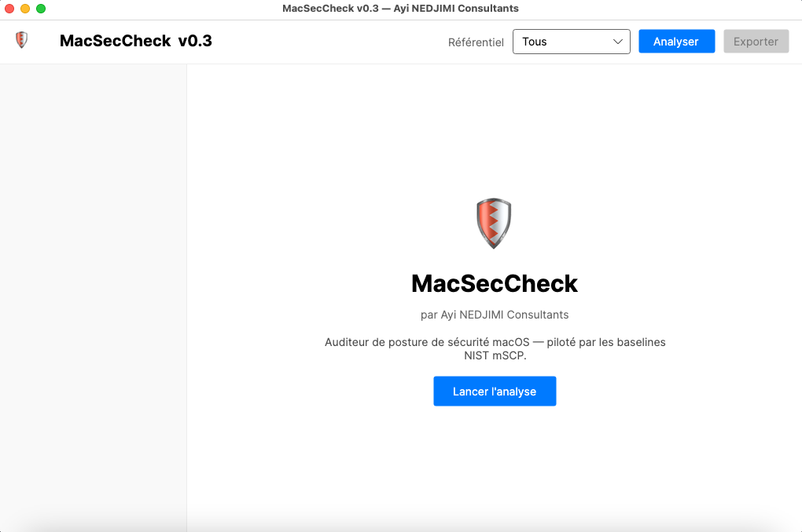

<div align="center">

# 🍎 MacSecCheck

### Application macOS d'audit de posture de sécurité — pilotée par les baselines NIST mSCP

**Interface graphique native (Avalonia) · 478 règles mSCP · 17 baselines (CIS, DISA STIG, NIST 800‑53, CMMC…) · rapports signés SHA‑256**

[](https://github.com/ayinedjimi/MacSecCheck/releases/latest)
[](https://www.apple.com/macos/)
[](https://dotnet.microsoft.com/)
[](#-telechargement--installation)
[](LICENSE)
[](https://ayinedjimi-consultants.fr)

🇫🇷 **Français** · [🇬🇧 English](README.en.md) · 🪟 Version Windows : [**WinCheckSec**](https://github.com/ayinedjimi/WinCheckSec)

</div>

---

## 🎯 En bref

**MacSecCheck** est une **application macOS native**, dotée d'une **interface graphique (Avalonia)**, qui audite en profondeur la configuration de sécurité d'un Mac et la compare aux référentiels officiels du **NIST macOS Security Compliance Project (mSCP)** — CIS, DISA STIG, NIST 800‑53, CMMC, CNSSI‑1253… Elle produit un score, des constats priorisés et un **rapport JSON forensique signé SHA‑256** pour une étude a posteriori. C'est le compagnon macOS naturel de [**WinCheckSec**](https://github.com/ayinedjimi/WinCheckSec), son équivalent pour Windows.

- 🖥️ **Application graphique** — plus besoin de terminal : tout se pilote depuis une fenêtre native macOS.
- 📦 **Autonome (self-contained)** — .NET 9, Avalonia et le moteur (478 règles mSCP) sont **embarqués** dans le `.app` ; rien à installer.
- 🔒 **100 % local & hors‑ligne** — aucune donnée ne quitte le poste.
- ⚡ **Rapide** — collecteurs exécutés en parallèle.
- 🧾 **Rapport forensique** — contexte hôte, scores par catégorie, empreinte **SHA‑256** re‑vérifiable, exportable en JSON.
- 🏛️ **Piloté par le NIST** — les 478 règles mSCP (commande de vérification + valeur attendue + remédiation + mapping CIS/NIST/DISA + technique MITRE ATT&CK) sont **embarquées**.
- 🖥️ **Universel** — macOS 12 (Monterey) et ultérieur, Intel & Apple Silicon.

---

## ⬇️ Téléchargement & installation

[](https://github.com/ayinedjimi/MacSecCheck/releases/latest)

1. **Téléchargez** l'archive : [**MacSecCheck-macOS-app.zip**](https://github.com/ayinedjimi/MacSecCheck/releases/download/v0.3/MacSecCheck-macOS-app.zip) (≈ 74 Mo) depuis la [**dernière release**](https://github.com/ayinedjimi/MacSecCheck/releases/latest).
2. **Double-cliquez** sur le zip pour le décompresser.
3. **Glissez `MacSecCheck.app`** dans votre dossier **Applications**.
4. Au premier lancement, faites **clic‑droit → Ouvrir** (l'app n'est pas encore signée Developer ID / notarisée — signature ad‑hoc).
5. Cliquez sur **« Analyser »** — c'est tout.

> 📦 **Application autonome (self-contained)** : le runtime **.NET**, le framework **Avalonia** et le moteur d'audit (**478 règles mSCP**) sont **tous embarqués** dans `MacSecCheck.app`. Aucune dépendance à installer, aucun accès réseau requis. Compatible **macOS 12 et ultérieur**, architectures **Intel et Apple Silicon**.

### Depuis les sources
```bash
git clone https://github.com/ayinedjimi/MacSecCheck.git
cd MacSecCheck
dotnet publish -c Release -r osx-arm64 --self-contained true -p:PublishSingleFile=true
# Intel : -r osx-x64
```

---

## 🖼️ L'application

<div align="center">

<br><em>MacSecCheck v0.3 — application native macOS (capture réelle)</em>
</div>

MacSecCheck se présente comme une véritable application macOS, structurée autour d'une **barre latérale** de navigation :

- **Vue d'ensemble** + une entrée par **catégorie** de contrôles, chacune affichant un **badge de gravité coloré** (Critique / Élevé / Moyen / Faible / OK) reflétant l'état de ses constats.
- **Écran d'accueil** avec titre et auteur de l'application.
- **Sélecteur de baseline** : **« Tous »** est sélectionné par défaut (`all_rules`, les **478 règles**), avec au choix `cis_lvl1`, `cis_lvl2`, `disa_stig`, `800-53r5_high`, et les autres baselines du mSCP.
- Bouton **« Analyser »** pour lancer l'audit.
- **Vue d'ensemble** : score global **/100** avec grade coloré (A → F), et cartes de synthèse par gravité (Critique / Élevé / Moyen / Faible / OK).
- **Vue catégorie** : liste de constats **dépliables**, chacun avec son détail, sa **remédiation**, sa **référence** (CIS / NIST 800‑53 / DISA STIG) et la **technique MITRE ATT&CK** associée.
- **Export** : génération d'un rapport **JSON forensique signé SHA‑256**, pour archivage ou analyse ultérieure.

### Aperçu réel d'une analyse

```
Baseline : all_rules — 333 règles sur 10 sections
Score    : 47/100  (grade D)
⛔ SIP .................. Désactivé   (Critique)
✖  FileVault ........... Inactif     (Élevé)
✔  Gatekeeper .......... Actif       (OK)
✔  XProtect ............ v5352       (OK)
▲  Pare-feu applicatif . Inactif     (Moyen)
▲  SSH / Partage écran . Actifs      (Moyen)
```

---

## ✨ Ce qui est audité

| Domaine | Contrôles | Source |
|---|---|---|
| 🔐 **Chiffrement** | FileVault (état, chiffrement en cours) | `fdesetup` |
| 🛡️ **Intégrité système** | SIP (System Integrity Protection) | `csrutil` |
| 🚦 **Contrôle applicatif** | Gatekeeper / notarisation | `spctl` |
| 🧱 **Réseau** | Pare‑feu applicatif, mode furtif | `socketfilterfw` |
| 🦠 **Antimalware** | XProtect + XProtect Remediator | plist XProtect |
| 🌐 **Surface d'attaque** | Connexion distante (SSH), partage d'écran | `systemsetup`, `launchctl` |
| 🔄 **Maintenance** | Mises à jour automatiques & correctifs de sécurité | `defaults` |
| 🏛️ **Conformité mSCP** | 478 règles / 17 baselines (CIS L1/L2, DISA STIG, 800‑53, CMMC…) | NIST mSCP |

Chaque constat porte une **gravité**, une **valeur observée vs attendue**, une **remédiation** (`sudo …`) et une **référence** (CIS / NIST 800‑53 / DISA STIG + technique MITRE ATT&CK).

---

## 🏛️ Baselines mSCP (NIST)

Les règles et baselines YAML du [**NIST macOS Security Compliance Project**](https://github.com/usnistgov/macos_security) (données publiées sous licence **NIST**, domaine public / œuvre du gouvernement américain) sont **embarquées** dans l'application — aucune arborescence externe requise.

- **478 règles** indexées, **17 baselines** macOS 26.
- La baseline **« Tous » (`all_rules`)** est sélectionnée par défaut dans l'interface et couvre l'intégralité des 478 règles.
- `cis_lvl1` → 98 règles / 5 sections (Auditing, Operating System, Password Policy, System Settings, Supplemental).
- Un **collecteur par section** exécute le `check` de chaque règle et compare la sortie à la valeur attendue → conforme / écart (gravité issue de la sévérité **DISA STIG**).

Baselines disponibles : `cis_lvl1`, `cis_lvl2`, `disa_stig`, `800-53r5_high/moderate/low`, `cmmc_lvl1/2`, `cnssi-1253_high/moderate/low`, `cisv8`, `800-171`, `hicp_lp`, `nlmapgov_base/plus`, `all_rules`.

La CLI reste disponible pour les usages scriptés / CI :

```bash
./macseccheck --list-baselines            # liste les baselines disponibles
./macseccheck --baseline cis_lvl2         # évalue une autre baseline
./macseccheck --baseline disa_stig        # STIG DISA
./macseccheck --dump-rule os_sip_enable   # diagnostic : check/attendu/fix résolus
./macseccheck --mscp /chemin/macos_security   # utilise un checkout externe (données à jour)
```

---

## 🧾 Rapport forensique

Le rapport JSON exporté depuis l'application contient : `SchemaVersion`, contexte `Host`, bloc `Execution`, `Summary` (score + grade + décompte par gravité), scores par catégorie, `Modules` horodatés avec chaque constat, et un bloc **`Integrity`** (empreinte **SHA‑256** re‑vérifiable). Code retour CLI : `0` si score ≥ 40, `2` sinon (exploitable en CI).

---

## 🗺️ Feuille de route

- [x] Moteur multiplateforme + 7 collecteurs natifs
- [x] Intégration des baselines mSCP (478 règles / 17 baselines)
- [x] **Interface graphique** (Avalonia)
- [x] **Packaging `.app` autonome** (self-contained, .NET + Avalonia + moteur embarqués)
- [ ] Collecteurs TCC (permissions vie privée), extensions système/kext, profils MDM, Lockdown Mode, Secure Boot (`bputil`)
- [ ] Exports PDF / HTML / SARIF
- [ ] Packaging **signé Developer ID + notarisé**, binaire universel officiel

Détails d'architecture : [`docs/ARCHITECTURE.fr.md`](docs/ARCHITECTURE.fr.md) · Guide d'utilisation : [`docs/USAGE.fr.md`](docs/USAGE.fr.md).

---

## 🔒 Confidentialité & éthique

MacSecCheck est un outil **défensif**. Il **lit** l'état du système (commandes en lecture seule) et **ne modifie rien**. Aucune donnée n'est transmise sur le réseau. À utiliser uniquement sur des systèmes que vous êtes autorisé à auditer.

---

## 👤 Auteur & services

Développé par **Ayi NEDJIMI** — [**Ayi NEDJIMI Consultants**](https://ayinedjimi-consultants.fr), expert en cybersécurité offensive & IA.

📚 **Ressources en lien** :
- [Audit de Sécurité Informatique PME : Guide Complet](https://ayinedjimi-consultants.fr/articles)
- [Audit Interne ISO 27001 : Méthode & Checklist](https://ayinedjimi-consultants.fr/iso-27001)
- [Conformité NIS 2](https://ayinedjimi-consultants.fr/nis-2) · [Audit Microsoft 365](https://ayinedjimi-consultants.fr/audit-microsoft-365)

💼 Besoin d'un audit de sécurité professionnel ? [**Demandez un devis →**](https://ayinedjimi-consultants.fr/contact)

---

## 📄 Licence

Code sous licence **MIT** — voir [`LICENSE`](LICENSE).
Données mSCP sous licence **NIST** (domaine public / œuvre du gouvernement américain) — voir [`mscp/LICENSE_mscp.md`](mscp/LICENSE_mscp.md).

<div align="center">
<sub>⭐ Si MacSecCheck vous est utile, laissez une étoile et rejoignez les <a href="https://github.com/ayinedjimi/MacSecCheck/discussions">Discussions</a> !</sub>
</div>
